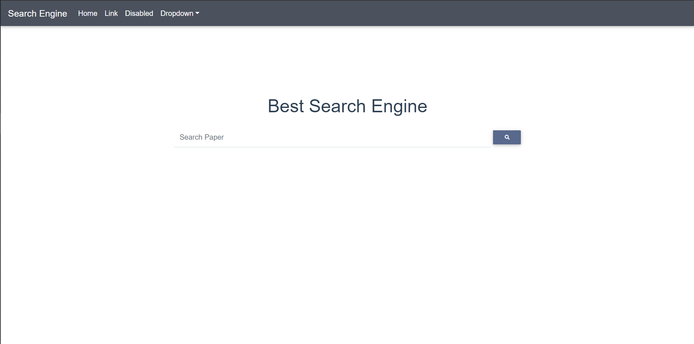
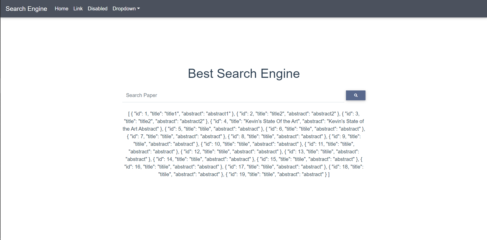

# VueDjangoTemplate

## Project Setup
For project setup, read frontend/README.md and APIs/CoreAPI/README.md

frontend will run on http://localhost:8081/

backend api will run on http://localhost:8000/api/v1/

## Issue with CORS
If running on chrome doesn't return the json response when clicking the search button, it's likely issues with CORS.
-> Running on incognito mode of chrome should work.

The issue seems to be with the new chrome security update, having "Access-Control-Allow-Origin" in the header still didn't work for me.

## TODO
### Frontend
Set up Vuex - store

Routing
### Backend API
Set up proper architecture as needed - service layer, repository layer, etc. 

Persist data from Elasticsearch and other db

## Preview - the only useless functionality right now

*click search

